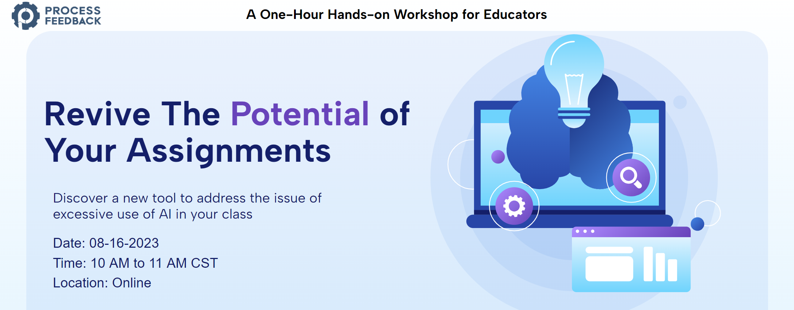

# Workshop: Revive the Potential of Your Assignments

<!-- 
| [Zoom](https://zoom.us/meeting/register/tJAvceihrT4vGdWPnbHva7Dy5vMtEhw9iZ-h) | Passcode: qgicgCK50
-->

## Agenda

| ⌚ | ⏳  |  Topic |
|:----------|:-------------|:------|
| 10:00 AM |   10 min  | [Introduction to Process Feedback](slides_08_16_2023.pdf) + Workshop Logistics |
|          |           | ✏️ &nbsp;  [Discussion board](./discussion_board_8_16_2023.pdf) |
|          |           | ✏️ &nbsp;  [Quiz](https://forms.gle/54mPpkyVYFH5VgD1A) for obtaining a certificate |
| 10:10 AM |    5 min  | 🖥️  &nbsp;  Presentation by [Travis Menghini](https://www.linkedin.com/in/travismenghini/), MICDS, St. Louis |
| 10:15 AM |   10 min  | Discover the **Build Editor** tool |
|          |           |  🖥️ &nbsp;  Demo of Build Editor |
|          |           |  ✏️ &nbsp;  Practice [Build an Editor](https://www.processfeedback.org/buildeditor) |
| 10:25 AM |    5 min  | 🖥️ Presentation by [Manu Bhandari](https://www.linkedin.com/in/manu-bhandari/), Arkansas State University, Arkansas |
| 10:30 AM |    5 min  | 🖥️ Presentation by [Mahesh Paudyal](https://www.linkedin.com/in/mahesh-paudyal-mahesh-kathmandu-9601a854/), Tribhuvan University, Nepal |
| 10:35 AM |   15 min  | Understanding a **Process Visualization Report** |
|          |           |  🖥️ &nbsp;  Demo of a [Writing Process Visualization Report](https://www.processfeedback.org/report/text_c2f19ef6-e272-4d38-b851-17cabde5a7aa?lang=en) |
|          |           |  🖥️ &nbsp;  Demo of a [Coding Process Visualization Report](https://www.processfeedback.org/report/code_2023-08-13-16-40_5af98528-f0fc-46b4-a209-92594ae4f533?lang=en) |
|          |           |  ✏️ &nbsp;  Practice and QnA |
| 10:50 AM |    5 min  | 🖥️ Demo of [Create a Question](https://www.processfeedback.org/uploadquestion) and [Dashboard](https://www.processfeedback.org/dashboard?FileId=question_2023-08-15-15-06_5651b989-5dda-48c2-b427-61df23227a42&DashboardAccessToken=2023-08-15-15-06_dea0c12a-8fb6-4d9f-9db4-7592bfe60e87) features |
| 10:55 AM |    5 min  | 🖥️ Presentation by [Shea Kerkhoff](https://www.linkedin.com/in/mskerkhoff/), University of Missouri-St. Louis |
| 11:00 AM |    5 min  | [OPTIONAL] QnA |

## Workshop Logistics

Welcome to our workshop! Here's what you need to know:

- **Public Name Listing:** We'll feature your name on our workshop page. If you prefer not to be listed, kindly let us know.
- **Discussion Board:** Share your questions, testimonials, feedback, and ideas for improvement in our [Discussion Board](./discussion_board_8_16_2023.pdf).
- **Future Speakers:** Interested in speaking at future workshops? Let us know if you'd like to contribute as a speaker.
- **Journalist Outreach:** We're searching for journalists interested in covering our work. If you have connections, please help us connect with them.
- **Custom Workshops:** If you'd like a workshop at your campus or department, I'd be thrilled to collaborate. Email me to discuss further.
- **Quiz and Certificate:** Feel free to take the [quiz](https://forms.gle/54mPpkyVYFH5VgD1A) during or after the workshop. Achieve 100% to earn your [certificate](example-certificate.png). Share it on social media!
- **Next Workshop:** Join us on September 20th for our next workshop, "**Effort Visualization Tools for Process-aware Teaching & Learning**," at the same time. [Register here](https://effort.eventbrite.com).

We're excited to have you with us!

# Invited Speakers

## Participants
1. **Dr. Sambriddhi Mainali**, Computer Science Department, University of Missouri-St. Louis
1. **Aakash Pokharel**, Chelsea International Academy, Nepal
1. **Usha Kulkarni**, Mathematics, Computer Science and Engineering Technology Department, Elizabeth City State University, North Carolina
1. **Shawna Climer**, Computer Science Department, University of Missouri-St. Louis
1. **Monoj Giri**, Tribhuvan University, Nepal
1. **Madison Weicht**, Computer Science Department, University of Missouri-St. Louis
1. **Dr. Jesse Eickholt**, Computer Science Department, Central Michigan University, Michigan
1. **Dr. Edward Mirielli**, 
1. **Olivia Biswas**, Computer Science Department, University of Missouri-St. Louis
1. **Nazire Koc**, Computer Science Department, University of Missouri-St. Louis
1. **George Witmer**, Professor of Practice, Lehigh University
1. **Bishal Shrestha**, Tribhuvan University, Nepal
1. **Qin Sun**, Department of Marketing, California State University Northridge 
1. **Shawn Higginbotham**, Computer Science Department, Webster UNiversity
1. **Tulay Girard**, Department of Marketing, Penn State Altoona
1. **Marcy Leeds**, Public Health Faculty, Slippery Rock University
1. **Qiong Cheng**, Computer Science Department, University of North Carolina at Charlotte
1. **Susan Bailey**, Associate Director, Distance and Online Education, University of Iowa
1. **Jane Sims**, The College of St.Scholastica
1. **Manju Khari**, Jawaharlal Nehru University, India
1. **Juan Sato-Franco**, Research Foundation CUNY - Hostos Community College
1. **Dawn Tolonen**, Department of Management, Xavier University
1. **Muxin Zhai**, Department of Finance and Economics, Texas State University
1. **Joaquin Palacios**, Computer Science Department, University of Texas at Austin 
1. **Micheal Sharpe**, Behavioral Sciences, York College, CUNY
1. **Lisa Kline**, University of Minnesota
1. **Shea Kerkhoff**, English Department, University of Missouri-St. Louis
1. **Dorothy Yuan**,
1. **Tim eddy**,
1. **Arohi Mishra**, 
1. **Victoria Maloy**
1. **Derrick Leflore**
1. **S Chattraji**
1. **Neelam Yadav**
1. **Flor Cattizo**,
1. **A Nicholas**, 

## Participant Testimonials:
> Thanks for this workshop on this new AI tool! I am doing a research on a ChatGPT and AI related topic on education and it is good to know you are developing this tool to address some issues we are facing.

> I will use this tool for high school students of my school and let you know.

> Thank you for a great workshop.

## Facilitator
* [Badri Adhikari](https://badriadhikari.github.io/)
 📬Reach at: `badri@processfeedback.org` or `adhikarib@umsl.edu`
  
## Co-facilitators
* [Nitesh Kafle](https://www.linkedin.com/in/niteshkafle/) - (attendance)
* [Rasik Nepal](https://www.linkedin.com/in/rasik-nepal-648559230/) - (attendance)
* [Aayusha Singh](https://www.linkedin.com/in/aayusha-singh-479354280/) - (certificate)
* [Sameep Dhakal](https://www.linkedin.com/in/sameep-dhakal-082155154/) - (certificate)
* [Nirala Lamichhane](https://www.linkedin.com/in/nirala-lamichhane/) - (slides)
* [Milan Adhikari](https://www.linkedin.com/in/adhikarimilan/) - (review live comments)
