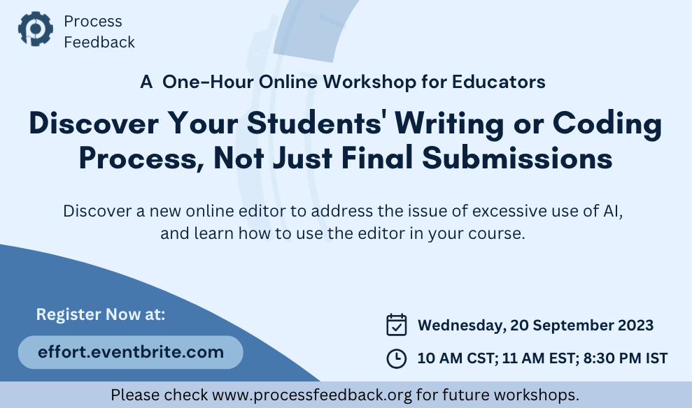

# Workshop: Revive the Potential of Your Assignments

<!-- 
| [Zoom](https://zoom.us/meeting/register/tJAvceihrT4vGdWPnbHva7Dy5vMtEhw9iZ-h) | Passcode: qgicgCK50
-->

## Agenda

| ⌚ | ⏳  |  Topic |
|:----------|:-------------|:------|
| 10:00 AM |   10 min  | [Introduction to Process Feedback](https://docs.google.com/presentation/d/10CRxYmiEw5lmzyGcmsqZv5GsQnNNY2MDqDJpkMLxfNw/edit?usp=sharing) + Workshop Logistics |
|          |           | ✏️ &nbsp;  [Discussion board](https://docs.google.com/document/d/1n54-HtjYewJ_iYP-ZYGrfU16uPdaAuLqsSuhjyc3fAQ/edit?usp=sharing) |
|          |           | ✏️ &nbsp;  [Quiz](https://forms.gle/54mPpkyVYFH5VgD1A) for obtaining a certificate |
| 10:10 AM |    5 min  | 🖥️  &nbsp;  Approaches to integrate Process Feedback Editor into a course or other contexts |
| 10:15 AM |   10 min  | Discover the **Create Editor** tool |
|          |           |  🖥️ &nbsp;  Demo of Create Editor |
|          |           |  ✏️ &nbsp;  Practice [Create an Editor](https://www.processfeedback.org/createeditor) |
| 10:25 AM |   15 min  | Understanding a **Process Visualization Report** |
|          |           |  🖥️ &nbsp;  Demo of a [Writing Process Visualization Report](https://www.processfeedback.org/report/text_c2f19ef6-e272-4d38-b851-17cabde5a7aa?lang=en) |
|          |           |  🖥️ &nbsp;  Demo of a [Coding Process Visualization Report](https://www.processfeedback.org/report/code_2023-09-19-14-33_d890c380-0be9-4a13-a440-093d96e8680b?lang=en) |
|          |           |  ✏️ &nbsp;  Practice and QnA |
| 10:40 AM |    10 min  | 🖥️ Demo of [Create a Question](https://www.processfeedback.org/createquestion) and [Dashboard](https://www.processfeedback.org/dashboard?FileId=question_2023-08-15-15-06_5651b989-5dda-48c2-b427-61df23227a42&DashboardAccessToken=2023-08-15-15-06_dea0c12a-8fb6-4d9f-9db4-7592bfe60e87) features |
| 10:50 AM |    2 min  | Closing remarks |
| 11:52 AM |    5 min  | [OPTIONAL] QnA |

## Workshop Logistics

Welcome to our workshop! Here's what you need to know:

- **Public Name Listing:** We'll feature your name on our workshop page. If you prefer not to be listed, kindly let us know.
- **Discussion Board:** Post questions, testimonials, feedback, and ideas for improvement in our [Discussion Board](https://docs.google.com/document/d/1n54-HtjYewJ_iYP-ZYGrfU16uPdaAuLqsSuhjyc3fAQ/edit?usp=sharing).
- **Future Speakers:** Interested in speaking at future workshops? Let us know if you'd like to join as a speaker.
- **Custom Workshops:** If you'd like a workshop at your campus or department, we will be thrilled to collaborate. Email us to discuss further.
- **Quiz and Certificate:** Please take the [quiz](https://forms.gle/54mPpkyVYFH5VgD1A) during or after the workshop. You will need to achieve 100% to earn your [certificate](example-certifcate.png).
- **Next Workshop:** Ask others to join our next workshop on October 18th. [Register here](https://effort.eventbrite.com).

We're excited to have you with us!

<!--
# Invited Speakers

 

-->

## Participants
1. **Tulay Girard**, Department of Marketing, Penn State Altoona
1. **Dr. Sambriddhi Mainali**, Computer Science Department, University of Missouri-St. Louis
1. **Monoj Giri**, Tribhuvan University, Nepal
1. **Bijaya Shrestha**, Missouri University of Science and Technology
1. **Flor Carrizo** 

## Participant Testimonials
> Thank you Badri ji and team for your work. This is an awesome tool to assure us, educators, that we are providing appropriate feedback to our students for their growth. Now I need to run for my class. Bye and have a good rest of the day/evening (depending upon which part of the world you are :D)

> Process Feedback seems to be a great tool in my view having heard your explanation - Excellent

> Thank you for this very informative session

## Facilitators
* 📬 [Badri Adhikari](https://badriadhikari.github.io/) [`badri@processfeedback.org`]
* 📬 [Milan Adhikari](https://milan-adhikari.github.io/) [`reach.out.to.milan@gmail.com`]
