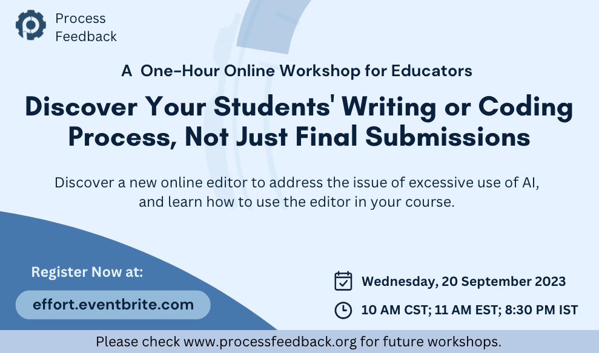

  

 

# Process Feedback Workshop

Welcome to the Process Feedback Workshop repository! This repository contains information about our upcoming workshop as well as insights from our previous workshop.If you an educator worried about excessive AI/ChatGPT usage in your class then  Attend this one-hour workshop and discover how you can address the emerging issue of excessive AI usage in education and providing educators the issue with innovative tools and strategies.
## 📅 Upcoming Workshop
 

  

### **Topic:** Effort Visualization Tools for Process-aware Teaching & Learning  
- **Date:** September 20, 2023 
- **Time:** 10 to 11 AM CST  
- **Duration:** 1 hour
- **Location:** Online (Zoom link will be shared)
- **Registration deadline:** Sep 18, 2023  

### **Workshop Overview**

In this dynamic one-hour workshop, we'll explore the crucial issue of excessive AI usage in education and introduce you to a powerful new tool called **Process Feedback**. This innovative tool empowers educators to gain deep insights into their students' writing or coding processes, ultimately fostering more effective teaching and personalized learning experiences.

### **What You'll Learn**

🚀 **Engage Creatively:** Explore innovative and engaging approaches to teaching writing or coding.

📊 **Analyze Progress:** Learn to interpret your students' efforts and individual learning journeys.

🔍 **Uncover Student Insights:** Unlock the power to delve deep into your students' writing and coding processes, providing a richer understanding of their learning journeys.

🌈 **Revamp Grading:** Experience the thrill of grading as you harness the valuable insights into student effort, making it not just effective but genuinely exciting.

### **Registration**

To secure your spot in this transformative workshop, please [click here](https://www.eventbrite.com/e/a-workshop-to-revive-the-potential-of-your-assignments-tickets-676155879437?aff=oddtdtcreator) and complete the registration process.

## 📝 Insights from Previous Workshop

### **Topic:** A Workshop to Revive the Potential of Your Assignments  
- **Date:** August 16, 2023 
- **4 invited guest speakers**   
- **30 participants from USA, Nepal, India, and Dominican Republic**

Missed our previous workshop or want to revisit the valuable insights shared? Dive deep into the knowledge we've shared in our [Previous Workshop README](./2023-08-16/).

---

For updates, announcements, and to join our community, follow us on[Linked In](https://www.linkedin.com/company/process-feedback/)

Have questions or need more information? Feel free to [contact us](mailto:contact@processfeedback.org).

