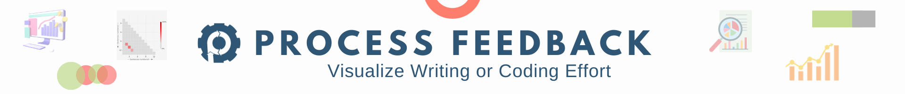
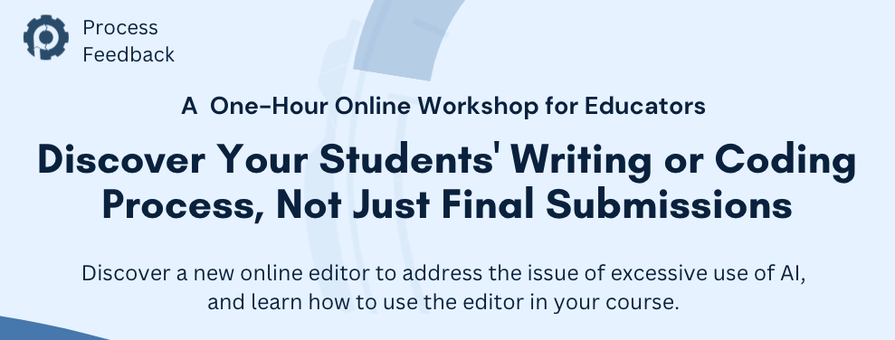

  

 

Welcome to the Process Feedback Workshops repository! This repository contains information about our upcoming workshop as well as insights from our previous workshops.

# 📅 Upcoming Workshop
 

  

### **Topic:** Discover Your Students' Writing or Coding Journey, Not Just Final Submissions  
- **Date:** December 20, 2023 
- **Time:** 10 to 11 AM CST  
- **Duration:** 1 hour
- **Location:** Online (Zoom link will be shared)
- **Registration deadline:** December 18, 2023  

### **Workshop Overview**

In this hands-on one-hour workshop, we'll explore the crucial issue of excessive AI usage in education and introduce you to a powerful new tool called **Process Feedback**. This free tool empowers educators to gain deep insights into their students' writing or coding processes, ultimately fostering more effective teaching and personalized learning experiences.

### **What You'll Learn**

* 💡 Learn to teach writing or coding in an innovative and engaging way,
* 📊 Discover how to gain insights into students' writing or computer programming processes, and
* 🔍 See how having access to student effort can make grading exciting and effective.

### **Registration**

To secure your spot please [click here](https://effort.eventbrite.com/) and complete the registration process.

# 📝 Previous Workshops

### [Discover Your Students' Writing or Coding Journey, Not Just Final Submissions](./2023-09-20/)
- **Date:** September 20, 2023 

### [A Workshop to Revive the Potential of Your Assignments](./2023-08-16/)
- **Date:** August 16, 2023 
- **4 invited guest speakers**   
- **30 participants from the USA, Nepal, India, and the Dominican Republic**

---
For updates and announcements please follow us on [Linked In](https://www.linkedin.com/company/process-feedback/)

Have questions or need more information? Feel free to [contact us](mailto:contact@processfeedback.org).

